[](https://www.apache.org/licenses/LICENSE-2.0) [](https://wdc-community.slack.com)

# Predict loan eligibility using IBM Watson Studio
 
Loans are the core business of loan companies. The main profit comes directly from the loan’s interest. The loan companies grant a loan after an intensive process of verification and validation. However, they still don’t have assurance if the applicant is able to repay the loan with no difficulties.

In this tutorial, we’ll build a predictive model to predict if an applicant is able to repay the lending company or not. We will prepare the data using Jupyter Notebook and then build the model using SPSS Modeler.

## Contents
1. [Learning Objectives](#learning-objectives)
1. [Prerequisites](#Prerequisites)
1. [Estimated time](#Estimated-time)
1. [Steps](#Steps)
1. [Notebook Details](#notebook-details)
1. [Summary](#Summary)

## Learning objectives
After completing this tutorial, you’ll understand how to:

* Add and prepare your data
* Build a machine learning model
* Save the model

## Prerequisites
In order to complete this tutorial, you will need the following:

* [IBM Cloud](https://www.ibm.com/cloud) account.
* [Object Storage](https://cloud.ibm.com/catalog/services/cloud-object-storage?cm_sp=ibmdev-_-developer-tutorials-_-cloudreg) Service.
* [Watson Studio](https://cloud.ibm.com/catalog/services/watson-studio?cm_sp=ibmdev-_-developer-tutorials-_-cloudreg) Service.
* [Machine Learning](https://cloud.ibm.com/catalog/services/machine-learning?cm_sp=ibmdev-_-developer-tutorials-_-cloudreg) Service.

## Estimated time
The overall time of reading and following this tutorial is approximately one hour.

## Steps
### Dataset
The dataset is from [Analytics Vidhya](https://datahack.analyticsvidhya.com/contest/practice-problem-loan-prediction-iii/#data_dictionary)

The format of the data:

* **Variable** Description
* **Loan_ID** Unique Loan ID
* **Gender** Male/ Female
* **Married** Applicant married (Y/N)
* **Dependents** Number of dependents
* **Education** Applicant Education (Graduate/ Under Graduate)
* **Self_Employed** Self employed (Y/N)
* **ApplicantIncome** Applicant income
* **CoapplicantIncome** Coapplicant income
* **LoanAmount** Loan amount in thousands
* **Loan_Amount_Term** Term of loan in months
* **Credit_History** Credit history meets guidelines
* **Property_Area** Urban/ Semi Urban/ Rural
* **Loan_Status** Loan approved (Y/N)

### Step 1. Create a project in Watson Studio
From Watson Studio main page, click on New project. Choose Complete to get the full functionalities. Once you enter your project name, click on Create.

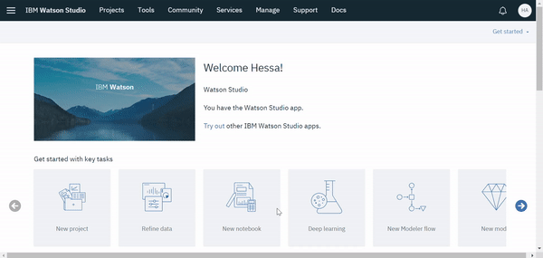

### Step 2. Upload the dataset to Watson Studio
Open Find and add data on the right-side panel, drag and drop the dataset (.csv file) from your computer to that area.

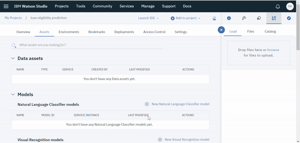

### Step 3. Create SPSS modeler flow
1. On the same Assets page, scroll down to Modeler flows.
1. Click the (+) New flow icon.
1. Under the ‘New’ tab, name your modeler ‘Loan Eligibility Predictive model’.
1. Click Create.

### Step 4. Add and prepare data
1. Add data to the canvas using the Data Asset node.
1. Double click on the node and click Change Data Asset to open the Asset Browser. Select train.csv then click OK and Save.

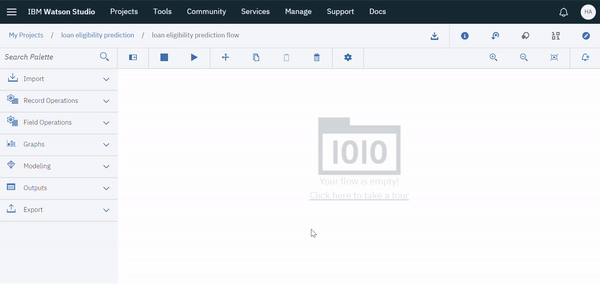

Let’s look into the summary statistics of our data using the Data Audit node.

1. Drag and drop the Data Audit node, and connect it with the Data Asset node. After running the node you can see your audit report on right side panel.

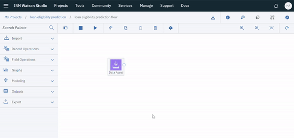

We can see that some columns have missing values. Let’s remove the rows that have null values using the Select node.

1. Drag and drop the Select node, connect it with the Data Asset node and right click on it and open the node.

1. Select discard mode and provide the below condition to remove rows with null values.

```(@NULL(Gender) or @NULL(Married) or @NULL(Dependents) or @NULL(Self_Employed) or @NULL(LoanAmount) or @NULL(Loan_Amount_Term) or @NULL(Credit_History))```

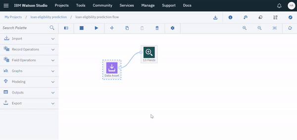

Now our data is clean, and we can proceed with building the model.

### Step 5. Configure variables type
1. Drag and Drop the Type node to configure variables type, from Field Operations palette.
1. Double click the node or right click to open it.

1. Choose Configure Types to read the metadata.

1. Change the Role from the drop down menu of [Loan_Status] from input to output.
1. Change the Role drop down menu of [LoanID] from none to Record ID.
1. Click Save.

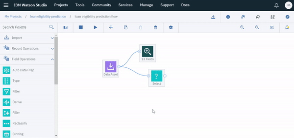

### Step 6. Build a machine learning model
The model predicts the loan eligibility of two classes (Either Y:Yes or N:No). Thus, the choice of algorithms fell into Bayesian networks since it’s known to give good results for predicting classification problems.

1. Split the Data into training and testing sets using the Partition node, from Field Operations palette.

1. Double click the Partition node to customize the partition size into 80:20, change the ratio in the Training Partition to 80 and Testing Partition to 20.

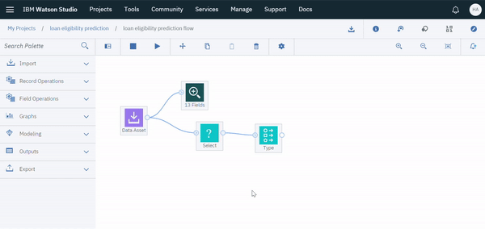

1. Drag and drop the Bayes Net node from the Modeling Palette.

1. Double click the node to change the settings. Check Use custom field roles to assign Loan_Status as the target and all the remaining attributes as input except Partition and Loan_ID. When you finish, click Save.

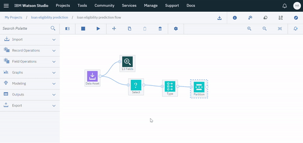

1. Run your Bayesian Network node, then you’ll see your model in an orange colored node.

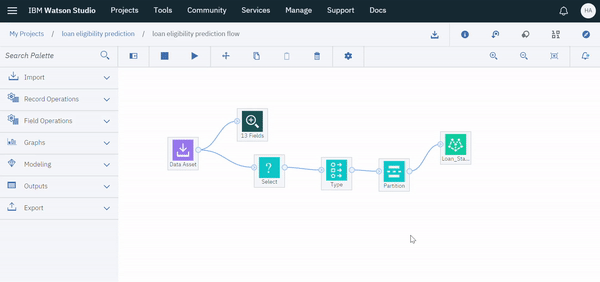

### Step 7. View the model
* Right click on the orange colored node, then click on View.
* Now you can see the Network Graph and other model information here.

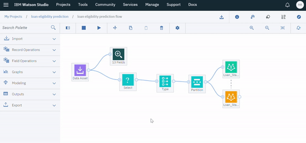

### Step 8. Evaluate the performance of the model
1. Drag and drop the Analysis node from the Output section, and connect it with the model.
1. After running the node, you can see your analysis report on the right side panel.

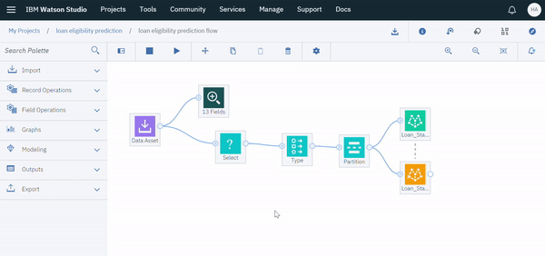

The analysis report shows we have achieved **82.3%** accuracy on our test data set with this model. At the end, you can build more models within the same canvas until you get the result you want.

### Step 9. Save the Model
Right-click on the Bayes Net node and select Save branch as a model. Enter a name for the model. A machine learning service should be added automatically if you already created one. Click on ```Save```.

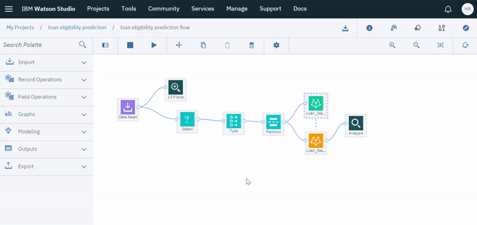

In the Asset page under Watson Machine Learning models you can access your saved model, where you can deploy it later.

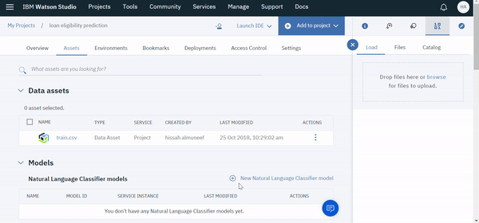

## Notebook Details
[Please click here for Jupyter Notebook Tutorial](loan-eligibility.md)

## Summary
In this tutorial, you learned how to create a complete predictive model, from importing the data, preparing the data, to training and saving the model. You also learned how to use SPSS Modeler and export the model to Watson Machine Learning models
