## Introduction
### Loans are the core business of banks. The main profit comes directly from the loan's interest. 

Loan companies grant a loan after an intensive process of verification and validation. However, they still don't know for sure if the applicant will be able to repay the loan with no difficulties.

In this tutorial, we'll build a predictive model to help determine if an applicant will be able to repay the lending company or not. We will prepare the data using a Jupyter Notebook and use various models to predict the target variable.

Here's a [link to GitHub Repository](https://github.com/mridulrb/Predict-loan-eligibility-using-IBM-Watson-Studio) if you want to follow along with the code.

## Table of Contents
1. [Getting the system ready and loading the data](#Getting-the-system-ready-and-loading-the-data)
1. [Understanding the data](Understanding-the-data)
1. [Exploratory Data Analysis (EDA)](#Exploratory-Data-Analysis-(EDA)) <br />
    i. [Univariate Analysis](#Univariate-Analysis) <br />
    ii. [Bivariate Analysis](#Bivariate-Analysis)
1. [Missing value](#Missing-value-imputation) 
1. [Outlier Treatment](#outlier-treatment)
1. [Model Building: Part 1](#model-buildingpart1)
1. [Logistic Regression using stratified k-folds cross-validation](#Logistic-Regression-using-stratified-k-folds-cross-validation)
1. [Feature Engineering](#Feature-Engineering)
1. [Model Building: Part 2](#model-buildingpart2) <br />
    i. [Logistic Regression](#Logistic-Regression) <br />
    ii. [Decision Tree](#Decision-Tree) <br />
    iii. [Random Forest](#Random-Forest) <br />
    iv. [XGBoost](#XGBoost)
1. [SPSS Modeler](#SPSS-Modeler)
1. [Blogs](#Blogs)
1. [Conclusion](#Conclusion)

## Getting the system ready and loading the data
We will be using Python for this course along with the below-listed libraries.
Specifications
* Python
* pandas
* seaborn
* sklearn

```
import pandas as pd 
import numpy as np
import seaborn as sns
import matplotlib.pyplot as plt
%matplotlib inline
import warnings
warnings.filterwarnings("ignore")
```

## Data
For this problem, we have three CSV files: train, test and sample submission.
* [Train file](https://github.com/mridulrb/Predict-loan-eligibility-using-IBM-Watson-Studio/blob/master/Dataset/train_ctrUa4K.csv) will be used for training the model, i.e. our model will learn from this file. It contains all the independent variables and the target variable.
* [Test file](https://github.com/mridulrb/Predict-loan-eligibility-using-IBM-Watson-Studio/blob/master/Dataset/test_lAUu6dG.csv) contains all the independent variables, but not the target variable. We will apply the model to predict the target variable for the test data.
* [Sample submission file](https://github.com/mridulrb/Predict-loan-eligibility-using-IBM-Watson-Studio/blob/master/Dataset/sample_submission_49d68Cx.csv) contains the format in which we have to submit out predictions


## Reading data
The first step is read the data. A pandas DataFrame is a two (or more) dimensional data structure – basically a table with rows and columns. The columns have names and the rows have indexes.
```
train = pd.read_csv('Dataset/train.csv')
train.head()
```
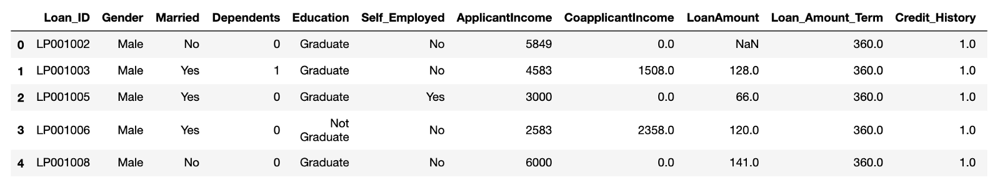
```
test = pd.read_csv('Dataset/test.csv')
test.head()
```
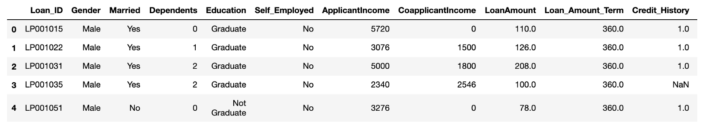

Let's make a copy of train and test data so that even if we have to make any changes in these datasets we would not lose the original datasets.
```
train_original=train.copy()
test_original=test.copy()
```
## Understanding the data
The objectives of data understanding are:

* Understand the attributes of the data.
* Summarize the data by identifying key characteristics, such as data volume and total number of variables in the data.
* Understand the problems with the data, such as missing values, inaccuracies, and outliers.
* Visualize the data to validate the key characteristics of the data or unearth problems with the summary statistics.

The ```columns``` attribute can be utilized to see all the column labels.
```
train.columns
```
```
Index(['Loan_ID', 'Gender', 'Married', 'Dependents', 'Education',
       'Self_Employed', 'ApplicantIncome', 'CoapplicantIncome', 'LoanAmount',
       'Loan_Amount_Term', 'Credit_History', 'Property_Area', 'Loan_Status'],
      dtype='object')
```
We have 12 independent variables and 1 target variable, ```Loan_Status``` in the train dataset.
```
test.columns
```
```
Index(['Loan_ID', 'Gender', 'Married', 'Dependents', 'Education',
       'Self_Employed', 'ApplicantIncome', 'CoapplicantIncome', 'LoanAmount',
       'Loan_Amount_Term', 'Credit_History', 'Property_Area'],
      dtype='object')
```      
We have similar features in the test dataset as the train dataset except for the Loan_Status. We will predict the Loan_Status using the model built using the train data.
```
train.dtypes
```
```
Loan_ID               object
Gender                object
Married               object
Dependents            object
Education             object
Self_Employed         object
ApplicantIncome        int64
CoapplicantIncome    float64
LoanAmount           float64
Loan_Amount_Term     float64
Credit_History       float64
Property_Area         object
Loan_Status           object
dtype: object
```
We can see there are three formats of data types:
* object: Object format means variables are categorical. Categorical variables in our dataset are: ```Loan_ID```, ```Gender```, ```Married```, ```Dependents```, ```Education```, ```Self_Employed```, ```Property_Area```, ```Loan_Status```.
* int64: It represents the integer variables. ```ApplicantIncome``` is of this format.
* float64: It represents the variable which have some decimal values involved. They are also numerical.

The ```shape`` attribute can be utilized to find the shape of the underlying data:
```
train.shape
```
```
(614, 13)
```
We have 614 rows and 13 columns in the train dataset.
```
test.shape
```
```
(367, 12)
```
We have 367 rows and 12 columns in test dataset.

To check the existing approvals, the ```value_counts()``` attribute can be used.
```
train['Loan_Status'].value_counts()
```
```
Y    422
N    192
Name: Loan_Status, dtype: int64
```
Normalize can be set to True to print proportions instead of number
```
train['Loan_Status'].value_counts(normalize=True) 
```
```
Y    0.687296
N    0.312704
Name: Loan_Status, dtype: float64
```
```
train['Loan_Status'].value_counts().plot.bar()
```
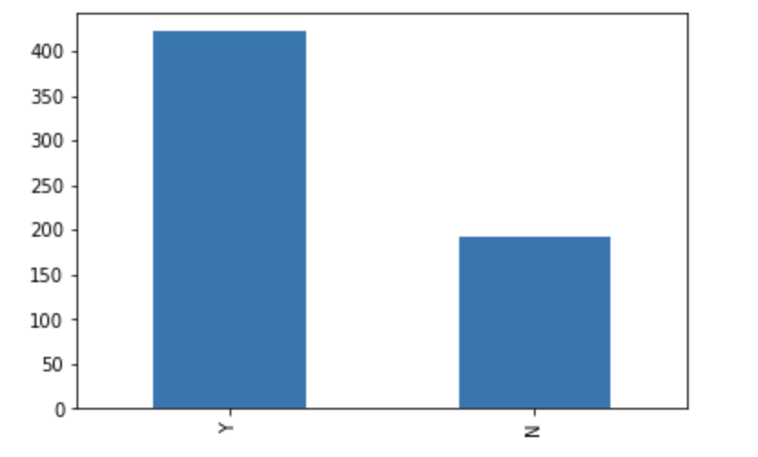
The loan of 422(around 69%) people out of 614 were approved.
Now, let's visualize each variable separately. Different types of variables are Categorical, ordinal, and numerical.
* Categorical features: These features have categories (```Gender```, ```Married```, ```Self_Employed```, ```Credit_History```, ```Loan_Status```)
* Ordinal features: Variables in categorical features having some order involved (```Dependents```, ```Education```, ```Property_Area```)
* Numerical features: These features have numerical values (```ApplicantIncome```, ```CoapplicantIncome```, ```LoanAmount```,```Loan_Amount_Term```)

## Exploratory Data Analysis (EDA)
## Univariate Analysis
## Independent Variable (Categorical)
```
train['Gender'].value_counts(normalize=True).plot.bar(figsize=(20,10), title='Gender')
plt.show()
train['Married'].value_counts(normalize=True).plot.bar(title='Married')
plt.show()
train['Self_Employed'].value_counts(normalize=True).plot.bar(title='Self_Employed')
plt.show()
train['Credit_History'].value_counts(normalize=True).plot.bar(title='Credit_History')
plt.show()
```
_1.png)
_2.png)

It can be inferred from the above bar plots that:
* 80% of applicants in the dataset are male.
* Around 65% of the applicants in the dataset are married.
* Around 15% of applicants in the dataset are self-employed.
* Around 85% of applicants have repaid their doubts.

## Independent Variable (Ordinal)
An ordinal variable is similar to a categorical variable.  The difference between the two is that there is a clear ordering of the variables.
```
train['Dependents'].value_counts(normalize=True).plot.bar(figsize=(24,6), title='Dependents')
plt.show()
train['Education'].value_counts(normalize=True).plot.bar(title='Education')
plt.show()
train['Property_Area'].value_counts(normalize=True).plot.bar(title='Property_Area')
plt.show()
```
.png)

The following inferences can be made from the above bar plots:
* Most of the applicants don't have any dependents.
* Around 80% of the applicants are Graduate.
* Most of the applicants are from the Semiurban area.

## Independent Variable (Numerical)
Up to this point we have seen the categorical and ordinal variables. Now let's visualize the numerical variables.

Let's look at the distribution of Applicant Income first.
```
sns.distplot(train['ApplicantIncome'])
plt.show()
train['ApplicantIncome'].plot.box(figsize=(16,5))
plt.show()
```
_1.png)

We can infer that most of the data in the distribution of applicant income is towards the left, which means it is not normally distributed. We will try to make it normal in later sections, as algorithms works better if the data is normally distributed.

The box plot confirms the presence of a lot of outliers/extreme values. This can be attributed to the income disparity in the society.

Part of this might be driven by the fact that we are looking at people with different levels of education. To help sort that out, let us separate them by education.

```
train.boxplot(column='ApplicantIncome', by = 'Education') 
plt.suptitle("")
```

_2.png)

We can see that there are a higher number of graduates with very high incomes, which are appearing to be outliers.
Let's look at the Coapplicant income distribution.
```
sns.distplot(train['CoapplicantIncome'])
plt.show()
train['CoapplicantIncome'].plot.box(figsize=(16,5))
plt.show()
```
_3.png)

We see a similar distribution as that of the applicant's income. The majority of co-applicants' income ranges from 0 to 5000. We also see a lot of outliers in the applicant's income, and it is not normally distributed.
```
train.notna()
sns.distplot(train['LoanAmount'])
plt.show()
train['LoanAmount'].plot.box(figsize=(16,5))
plt.show()
```
_4.png)

We see a lot of outliers in this variable, and the distribution is fairly normal. We will deal with the outliers in later sections.

## Bivariate Analysis
Let's recall some of the hypotheses that we generated earlier:
* Applicants with high incomes should have more chances of loan approval.
* Applicants who have repaid their previous debts should have higher chances of loan approval.
* Loan approval should also depend on the loan amount. If the loan amount is less, the chances of loan approval should be high.
* Lesser the amount to be paid monthly to repay the loan, the higher the chances of loan approval.

Let's try to test the above-mentioned hypotheses using bivariate analysis.

After looking at every variable individually in univariate analysis, we will now explore them again with respect to the target variable.

## Categorical Independent Variable vs Target Variable
First of all, we will find the relationship between the target variable and the categorical independent variables.

Let's look at the stacked bar plot now which will give us the proportion of approved and unapproved loans.
```
Gender=pd.crosstab(train['Gender'],train['Loan_Status'])
Gender.div(Gender.sum(1).astype(float), axis=0).plot(kind="bar",stacked=True,figsize=(4,4))
plt.show()
```
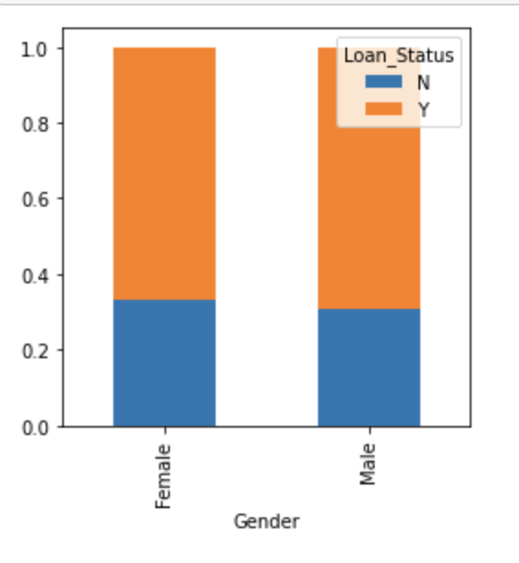
We can infer that the proportion of male and female applicants is more or less the same for both approved and unapproved loans.

Now let's visualize the remaining categorical variables vs the target variable.
```
Married=pd.crosstab(train['Married'],train['Loan_Status'])
Dependents=pd.crosstab(train['Dependents'],train['Loan_Status'])
Education=pd.crosstab(train['Education'],train['Loan_Status'])
Self_Employed=pd.crosstab(train['Self_Employed'],train['Loan_Status'])
Married.div(Married.sum(1).astype(float), axis=0).plot(kind="bar",stacked=True,figsize=(4,4))
plt.show()
Dependents.div(Dependents.sum(1).astype(float), axis=0).plot(kind="bar",stacked=True,figsize=(4,4))
plt.show()
Education.div(Education.sum(1).astype(float), axis=0).plot(kind="bar",stacked=True,figsize=(4,4))
plt.show()
Self_Employed.div(Self_Employed.sum(1).astype(float), axis=0).plot(kind="bar",stacked=True,figsize=(4,4))
plt.show()
```
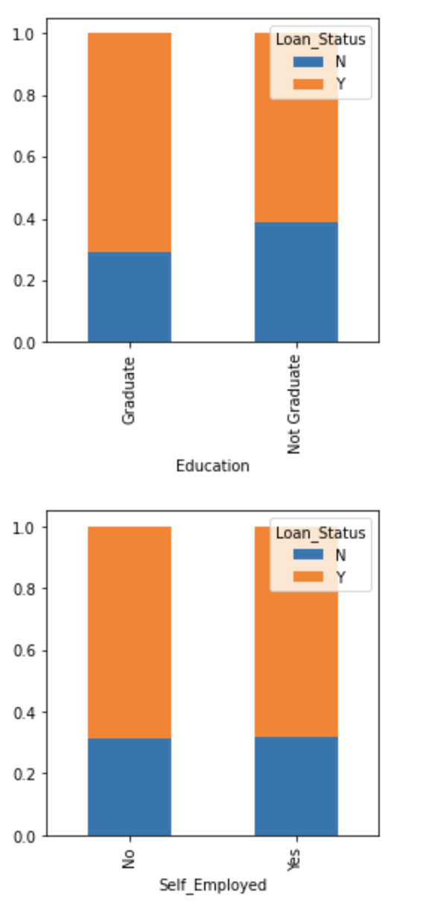
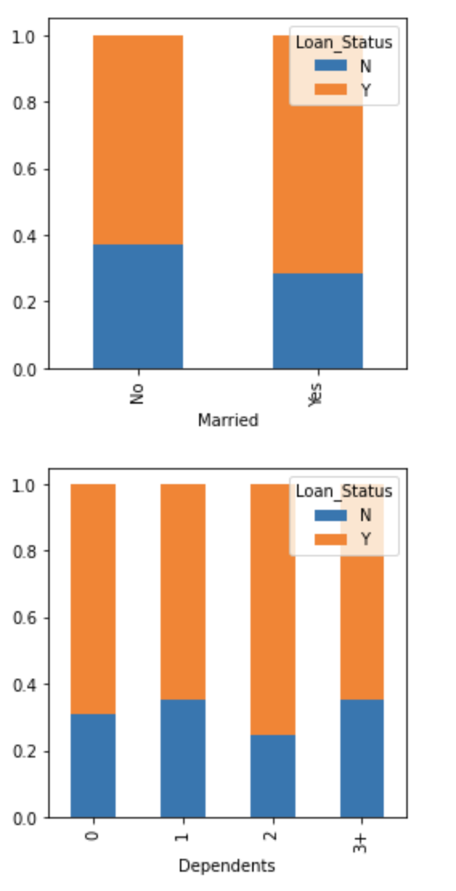

We can gather the following from these graphs:
* The proportion of married applicants is higher for approved loans.
* Distribution of applicants with 1 or 3+ dependents is similar across both the categories of ```Loan_Status```.
* There is nothing significant we can infer from ```Self_Employed``` vs ```Loan_Status``` plot.

Now we will look at the relationship between remaining categorical independent variables and ```Loan_Status```.
```
Credit_History=pd.crosstab(train['Credit_History'],train['Loan_Status'])
Property_Area=pd.crosstab(train['Property_Area'],train['Loan_Status'])
Credit_History.div(Credit_History.sum(1).astype(float), axis=0).plot(kind="bar",stacked=True,figsize=(4,4))
plt.show()
Property_Area.div(Property_Area.sum(1).astype(float), axis=0).plot(kind="bar",stacked=True)
plt.show()
```
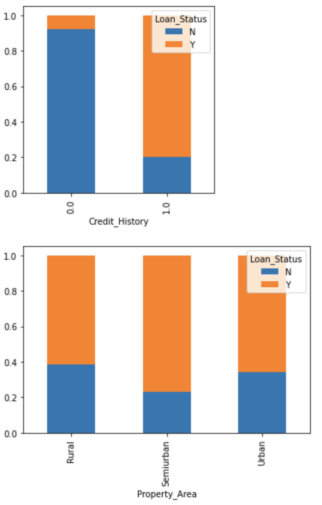
* It seems people with a credit history as 1 are more likely to get their loans approved.
* The proportion of loans getting approved in the semi-urban area is higher as compared to that in rural or urban areas.

Now let's visualize numerical independent variables with respect to the target variable.
## Numerical Independent Variable vs Target Variable
We will try to find the mean income of people for which the loan has been approved vs the mean income of people for which the loan has not been approved.
```
train.groupby('Loan_Status')['ApplicantIncome'].mean().plot.bar()
```
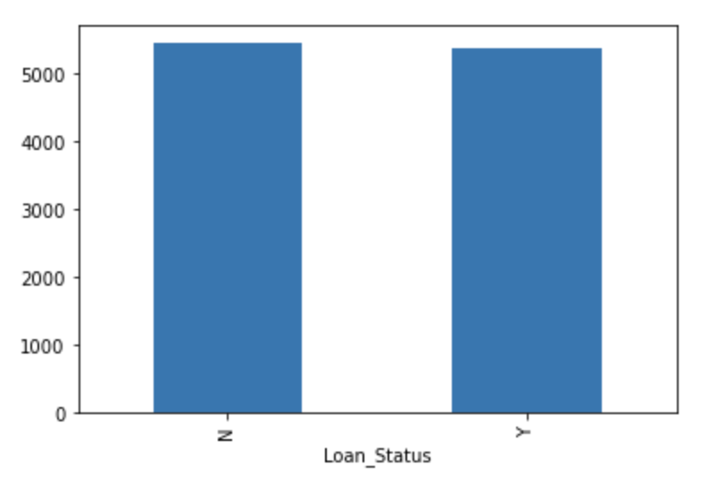
Here the y-axis represents the mean applicant income. We don't see any change in the mean income. 

So, let's make bins for the applicant income variable based on the values in it and analyze the corresponding loan status for each bin.
```
bins=[0,2500,4000,6000,81000]
group=['Low','Average','High','Very high']
train['Income_bin']=pd.cut(train['ApplicantIncome'],bins,labels=group)
Income_bin=pd.crosstab(train['Income_bin'],train['Loan_Status'])
Income_bin.div(Income_bin.sum(1).astype(float), axis=0).plot(kind="bar",stacked=True)
plt.xlabel('ApplicantIncome')
P=plt.ylabel('Percentage')
```
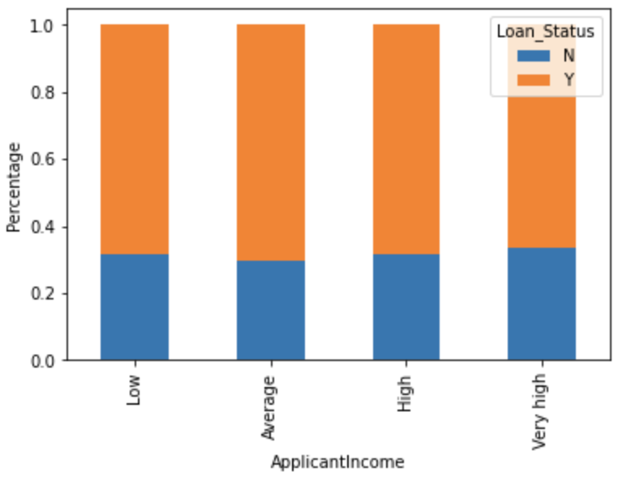
It can be inferred that Applicant's income does not affect the chances of loan approval which contradicts our hypothesis in which we assumed that if the applicant's income is high the chances of loan approval will also be high.
We will analyze the ```coapplicant income``` and ```loan amount``` variable in a similar manner.
```
bins=[0,1000,3000,42000]
group=['Low','Average','High']
train['Coapplicant_Income_bin']=pd.cut(train['CoapplicantIncome'],bins,labels=group)
Coapplicant_Income_bin=pd.crosstab(train['Coapplicant_Income_bin'],train['Loan_Status'])
Coapplicant_Income_bin.div(Coapplicant_Income_bin.sum(1).astype(float), axis=0).plot(kind="bar",stacked=True)
plt.xlabel('CoapplicantIncome')
P=plt.ylabel('Percentage')
```

The above graph shows that if the co-applicant's income is lower, the chances of loan approval are still high. But this does not look right.

This may be because most of the applicants don't have any co-applicant so the co-applicant income for such applicants is 0. This means that the loan approval is not dependent on it.

So, we can make a new variable in which we will combine the applicant's and co-applicants income to visualize the combined effect of income on loan approval.

Let's combine the ```Applicant Income``` and ```Co-applicant Income``` and see the combined effect of ```Total Income``` on the ```Loan_Status```.
```
train['Total_Income']=train['ApplicantIncome']+train['CoapplicantIncome']
bins=[0,2500,4000,6000,81000]
group=['Low','Average','High','Very high']
train['Total_Income_bin']=pd.cut(train['Total_Income'],bins,labels=group)
Total_Income_bin=pd.crosstab(train['Total_Income_bin'],train['Loan_Status'])
Total_Income_bin.div(Total_Income_bin.sum(1).astype(float), axis=0).plot(kind="bar",stacked=True)
plt.xlabel('Total_Income')
P=plt.ylabel('Percentage')
```
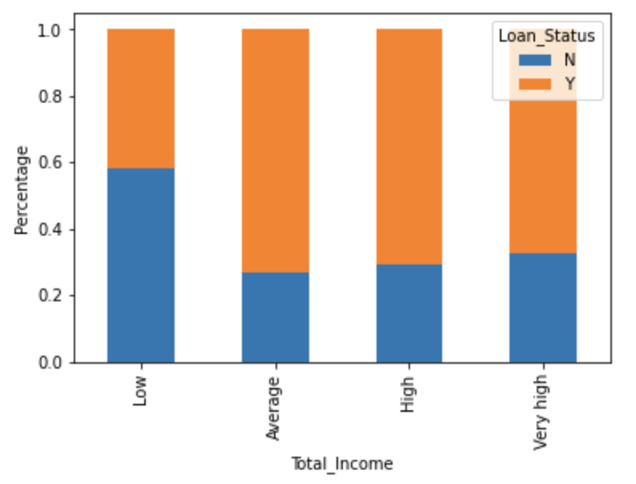
We can see that Proportion of loans getting approved for applicants having low ```Total_Income``` is very less compared to that of applicants with Average, High & Very High Income.

Let's visualize the Loan Amount variable.
```
bins=[0,100,200,700]
group=['Low','Average','High']
train['LoanAmount_bin']=pd.cut(train['LoanAmount'],bins,labels=group)
LoanAmount_bin=pd.crosstab(train['LoanAmount_bin'],train['Loan_Status'])
LoanAmount_bin.div(LoanAmount_bin.sum(1).astype(float), axis=0).plot(kind="bar",stacked=True)
plt.xlabel('LoanAmount')
P=plt.ylabel('Percentage')
```
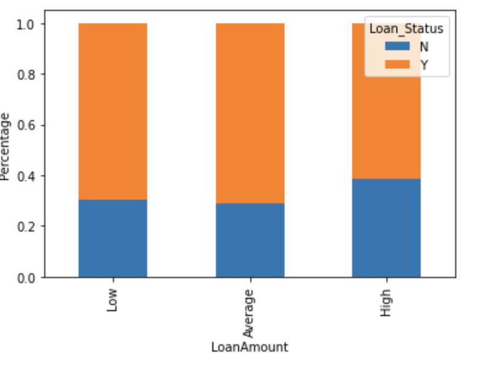
We can see that the proportion of approved loans is higher for Low and Average Loan Amount compared to High Loan Amount. This supports our hypothesis in which we considered that the chances of loan approval would be high when the loan amount is lower.

Let's drop the bins which we created for the exploration part. We will change the 3+ in the dependents variable to 3 to make it a numerical variable. We will also convert the target variable's categories into 0 and 1 so that we can find its correlation with numerical variables.

One more reason to do so is that some models like logistic regression take only numeric values as input. We will replace N with 0 and Y with 1.
```
train=train.drop(['Income_bin', 'Coapplicant_Income_bin', 'LoanAmount_bin', 'Total_Income_bin', 'Total_Income'], axis=1)
train['Dependents'].replace('3+', 3,inplace=True)
test['Dependents'].replace('3+', 3,inplace=True)
train['Loan_Status'].replace('N', 0,inplace=True)
train['Loan_Status'].replace('Y', 1,inplace=True)
```
Now let's look at the correlation between all the numerical variables. We will use the heat map to visualize the correlation.

Heat maps visualize data through variations in coloring. The variables with darker colors have a stronger correlation.
```
matrix = train.corr()
f, ax = plt.subplots(figsize=(9,6))
sns.heatmap(matrix,vmax=.8,square=True,cmap="BuPu", annot = True)
```
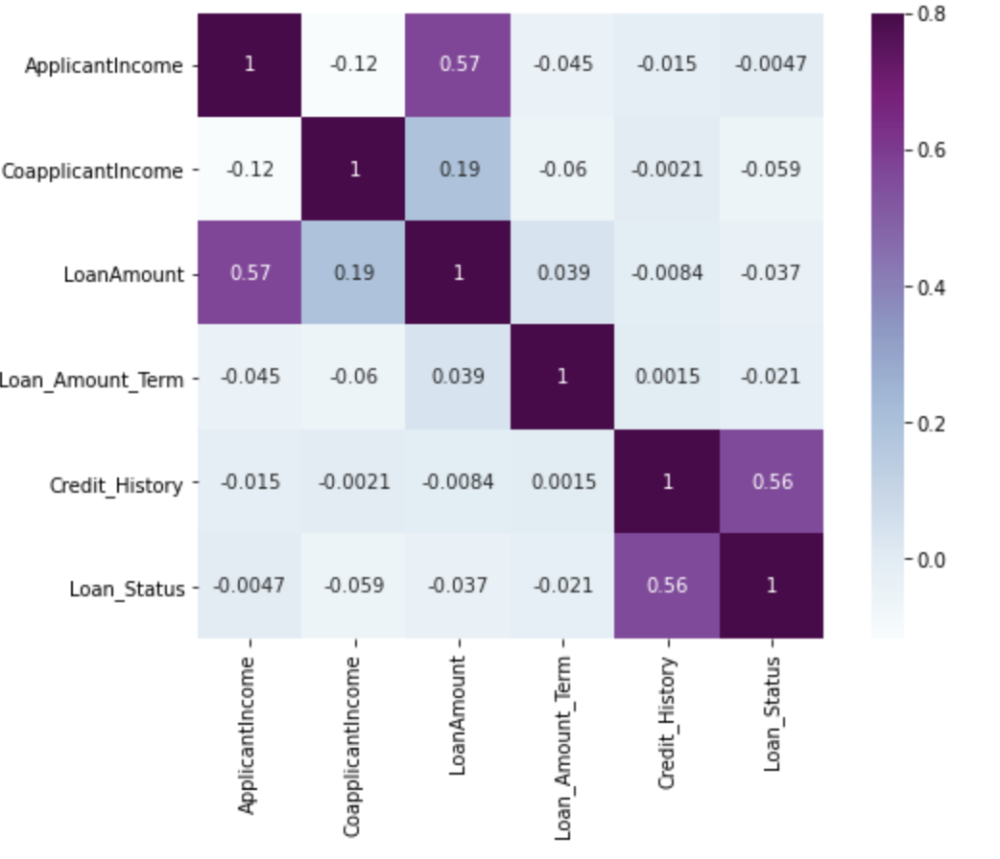
We see that the most correlate variables are (```ApplicantIncome``` - ```LoanAmount```) and (```Credit_History``` - ```Loan_Status```). ```LoanAmount``` is also correlated with ```CoapplicantIncome```.
## Missing value imputation
Let's list out feature-wise count of missing values.
```
train.isnull().sum()
```
```
Loan_ID               0
Gender               13
Married               3
Dependents           15
Education             0
Self_Employed        32
ApplicantIncome       0
CoapplicantIncome     0
LoanAmount           22
Loan_Amount_Term     14
Credit_History       50
Property_Area         0
Loan_Status           0
dtype: int64
```
There are missing values in ```Gender```, ```Married```, ```Dependents```, ```Self_Employed```, ```LoanAmount```, ```Loan_Amount_Term```, and ```Credit_History features```.

We will treat the missing values in all the features one by one.
We can consider these methods to fill the missing values:

* For numerical variables: imputation using mean or median
* For categorical variables: imputation using mode

There are very less missing values in ```Gender```, ```Married, Dependents```, ```Credit_History```, and ```Self_Employed``` features so we can fill them using the mode of the features.

```
train['Gender'].fillna(train['Gender'].mode()[0], inplace=True)
train['Married'].fillna(train['Married'].mode()[0], inplace=True)
train['Dependents'].fillna(train['Dependents'].mode()[0], inplace=True)
train['Self_Employed'].fillna(train['Self_Employed'].mode()[0], inplace=True)
train['Credit_History'].fillna(train['Credit_History'].mode()[0], inplace=True)
```
Now let's try to find a way to fill the missing values in ```Loan_Amount_Term```. We will look at the value count of the Loan amount term variable.
```
train['Loan_Amount_Term'].value_counts()
```
```
360.0    512
180.0     44
480.0     15
300.0     13
84.0       4
240.0      4
120.0      3
36.0       2
60.0       2
12.0       1
Name: Loan_Amount_Term, dtype: int64
```
It can be seen that in the loan amount term variable, the value of 360 is repeating the most. So we will replace the missing values in this variable using the mode of this variable.
```
train['Loan_Amount_Term'].fillna(train['Loan_Amount_Term'].mode()[0], inplace=True)
```
Now we will see the ```LoanAmount``` variable. As it is a numerical variable, we can use mean or median to impute the missing values. 

We will use the median to fill the null values as earlier we saw that the loan amount has outliers so the mean will not be the proper approach as it is highly affected by the presence of outliers.
```
train['LoanAmount'].fillna(train['LoanAmount'].median(), inplace=True)
```
Now let's check whether all the missing values are filled in the dataset.
```
train.isnull().sum()
```
```
Loan_ID              0
Gender               0
Married              0
Dependents           0
Education            0
Self_Employed        0
ApplicantIncome      0
CoapplicantIncome    0
LoanAmount           0
Loan_Amount_Term     0
Credit_History       0
Property_Area        0
Loan_Status          0
dtype: int64
```
As we can see that all the missing values have been filled in the test dataset. Let's fill all the missing values in the test dataset too with the same approach.
```
test['Gender'].fillna(train['Gender'].mode()[0], inplace=True)
test['Married'].fillna(train['Married'].mode()[0], inplace=True)
test['Dependents'].fillna(train['Dependents'].mode()[0], inplace=True)
test['Self_Employed'].fillna(train['Self_Employed'].mode()[0], inplace=True)
test['Credit_History'].fillna(train['Credit_History'].mode()[0], inplace=True)
test['Loan_Amount_Term'].fillna(train['Loan_Amount_Term'].mode()[0], inplace=True)
test['LoanAmount'].fillna(train['LoanAmount'].median(), inplace=True)
```
## Outlier Treatment
As we saw earlier in univariate analysis, the ```LoanAmount``` contains outliers. So we have to treat them as if the presence of outliers affects the distribution of the data.

Let's examine what can happen to a data set with outliers.

For the sample data set:
1,1,2,2,2,2,3,3,3,4,4

We find the following: **mean**, **median**, **mode**, and **standard deviation**

* Mean = 2.58
* Median = 2.5
* Mode=2
* Standard Deviation = 1.08

If we add an outlier to the data set:
1,1,2,2,2,2,3,3,3,4,4,400

The new values of our statistics are:

* Mean = 35.38
* Median = 2.5
* Mode=2
* Standard Deviation = 114.74

We can see that having outliers often has a significant effect on the mean and standard deviation which affects the distribution. We should therefore remove outliers from our data sets.

Because of these outliers, the bulk of the data in the loan amount is at the left and the right tail is longer. This is called right skewness.

One way to remove the skewness is by doing a log transformation. As we take the log transformation, it does not affect the smaller values much but reduces the larger values. So, we get a distribution similar to normal distribution.

Let's visualize the effect of log transformation. We will do similar changes to the test file simultaneously.
```
train['LoanAmount_log']=np.log(train['LoanAmount'])
train['LoanAmount_log'].hist(bins=20)
test['LoanAmount_log']=np.log(test['LoanAmount'])
```
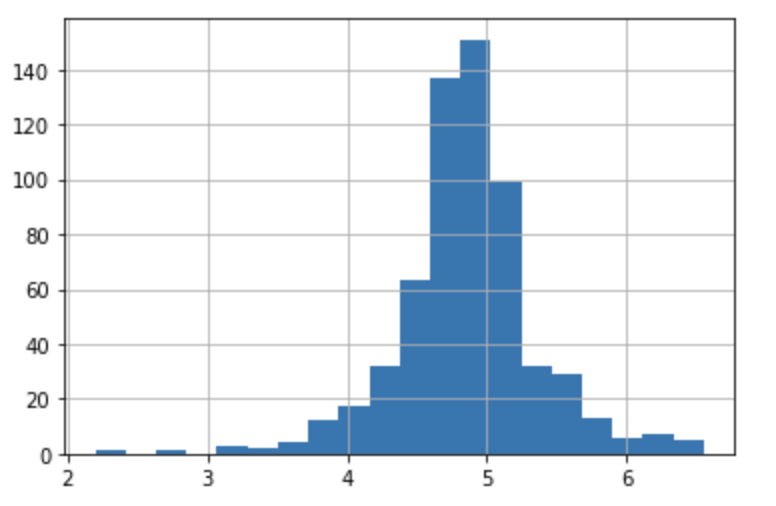
Now the distribution looks much closer to normal and the effect of extreme values has been significantly reduced.

Now let's build a logistic regression model and make predictions for the test dataset.

## Model Building:Part 1
Let us make our first model predict the target variable. We will start with Logistic Regression which is used for predicting binary outcome.
* Logistic Regression is a classification algorithm. It is used to predict a binary outcome (1 / 0, Yes / No, True / False) given a set of independent variables.
* Logistic regression is an estimation of Logit function. Logit function is simply a log of odds in favor of the event.
* This function creates an S-shaped curve with the probability estimate, which is very similar to the required stepwise function

To learn further on logistic regression, refer to this [article] (https://www.analyticsvidhya.com/blog/2015/10/basics-logistic-regression/):

Let's drop the ```Loan_ID``` variable as it does not have any effect on the loan status. We will do the same changes to the test dataset which we did for the training dataset.

```
train=train.drop('Loan_ID',axis=1)
test=test.drop('Loan_ID',axis=1)
```
We will use scikit-learn (sklearn) for making different models which is an open source library for Python. It is one of the most efcient tool which contains many inbuilt functions that can be used for modeling in Python.

To learn further about sklearn, you can [check out this video course](http://scikit-learn.org/stable/tutorial/index.html)

Sklearn requires the target variable in a separate dataset. So, we will drop our target variable from the train dataset and save it in another dataset.
```
X = train.drop('Loan_Status',1)
y = train.Loan_Status
```
Now we will make dummy variables for the categorical variables. Dummy variable turns categorical variables into a series of 0 and 1, making them lot easier to quantify and compare. 

Let us understand the process of dummies first:
* Consider the ```Gender``` variable. It has two classes, Male and Female.
* As logistic regression takes only the numerical values as input, we have to change male and female into numerical value.
* Once we apply dummies to this variable, it will convert the ```Gender``` variable into two variables(```Gender_Male``` and ```Gender_Female```), one for each class, i.e. Male and Female.
* ```Gender_Male``` will have a value of 0 if the gender is Female and a value of 1 if the gender is Male.

```
X = pd.get_dummies(X)
train=pd.get_dummies(train)
test=pd.get_dummies(test)
```
Now we will train the model on training dataset and make predictions for the test dataset. But can we validate these predictions? One way of doing this is we can divide our train dataset into two parts: train and validation. We can train the model on this train part and using that make predictions for the validation part. In this way we can validate our predictions as we have the true predictions for the validation part (which we do not have for the test dataset).

We will use the ```train_test_split``` function from sklearn to divide our train dataset. So, first let us import ```train_test_split```.

```
from sklearn.model_selection import train_test_split
x_train, x_cv, y_train, y_cv = train_test_split(X,y, test_size=0.3)
```
The dataset has been divided into training and validation part. Let us import LogisticRegression and ```accuracy_score``` from sklearn and fit the logistic regression model.
from ```sklearn.linear_model``` import ```LogisticRegression```:

```
from sklearn.metrics import accuracy_score
model = LogisticRegression()
model.fit(x_train, y_train)
```
```
LogisticRegression()
```
Here the C parameter represents inverse of regularization strength. Regularization is applying a penalty to increasing the magnitude of parameter values in order to reduce overfitting. Smaller values of C specify stronger regularization. 

To learn about other parameters, you can [check out this article here.](http://scikit- learn.org/stable/modules/generated/sklearn.linear_model.LogisticRegression.html)
Let's predict the Loan_Status for validation set and calculate its accuracy.
```
pred_cv = model.predict(x_cv)
accuracy_score(y_cv,pred_cv)
```
```
0.7891891891891892
```
So our predictions are almost 80% accurate, i.e. we have identified 80% of the loan status correctly.

Let's make predictions for the test dataset.
```
pred_test = model.predict(test)
```
Let's import the submission file which we have to submit on the solution checker.
```
submission = pd.read_csv('Dataset/sample_submission.csv')
submission.head()
```
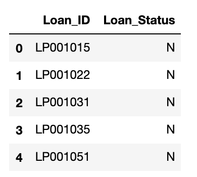
We only need the ```Loan_ID``` and the corresponding ```Loan_Status``` for the final submission. We will fill these columns with the ```Loan_ID``` of test dataset and the predictions that we made, ```pred_test```, respectively.
```
submission['Loan_Status']=pred_test
submission['Loan_ID']=test_original['Loan_ID']
```
Remember we need predictions in Y and N. So let's convert 1 and 0 to Y and N.
```
submission['Loan_Status'].replace(0, 'N', inplace=True)
submission['Loan_Status'].replace(1, 'Y', inplace=True)
```
Finally, we will convert the submission to .csv format.
```
pd.DataFrame(submission, columns=['Loan_ID','Loan_Status']).to_csv('Output/logistic.csv')
```

## Logistic Regression using stratified k-folds cross-validation
To check how robust our model is to unseen data, we can use Validation. This is a technique that involves reserving a particular sample of a dataset on which you do not train the model. Later, you test your model on this sample before finalizing it.

Some of the common methods for validation are listed below:
* The validation set approach
* k-fold cross-validation
* Leave one out cross-validation (LOOCV)
* Stratified k-fold cross-validation

If you wish to know more about validation techniques, then [please refer to this article.] (https://www.analyticsvidhya.com/blog/2018/05/improve-model-performance-cross-validation-in-python-r/)

In this section, we will learn about stratified k-fold cross-validation. Let us understand how it works:
* Stratification is the process of rearranging the data so as to ensure that each fold is a good representative of the whole.
* For example, in a binary classification problem where each class comprises of 50% of the data, it is best to arrange the data such that in every fold, each class comprises of about half the instances.
* It is generally a better approach when dealing with both bias and variance.
* A randomly selected fold might not adequately represent the minor class, particularly in cases where there is a huge class imbalance.

Let's import ```StratifiedKFold``` from ```sklearn``` and fit the model.
```
from sklearn.model_selection import StratifiedKFold
```
Now let's make a cross-validation logistic model with stratified 5 folds and make predictions for the test dataset.
```
i=1
mean = 0
kf = StratifiedKFold(n_splits=5,random_state=1)
for train_index,test_index in kf.split(X,y):
 print ('\n{} of kfold {} '.format(i,kf.n_splits))
 xtr,xvl = X.loc[train_index],X.loc[test_index]
 ytr,yvl = y[train_index],y[test_index]
 model = LogisticRegression(random_state=1)
 model.fit(xtr,ytr)
 pred_test=model.predict(xvl)
 score=accuracy_score(yvl,pred_test)
 mean += score
 print ('accuracy_score',score)
 i+=1
 pred_test = model.predict(test)
 pred = model.predict_proba(xvl)[:,1]
print ('\n Mean Validation Accuracy',mean/(i-1))
```
```
1 of kfold 5 
accuracy_score 0.8048780487804879

2 of kfold 5 
accuracy_score 0.7642276422764228

3 of kfold 5 
accuracy_score 0.7804878048780488

4 of kfold 5 
accuracy_score 0.8455284552845529

5 of kfold 5 
accuracy_score 0.8032786885245902

Mean Validation Accuracy 0.7996801279488205
```
The mean validation accuracy for this model turns out to be 0.80. Let us visualize the roc curve.
```
from sklearn import metrics
fpr, tpr, _ = metrics.roc_curve(yvl, pred)
auc = metrics.roc_auc_score(yvl, pred)
plt.figure(figsize=(12,8))
plt.plot(fpr, tpr, label="validation, auc="+str(auc))
plt.xlabel('False Positive Rate')
plt.ylabel('True Positive Rate')
plt.legend(loc=4)
plt.show()
```
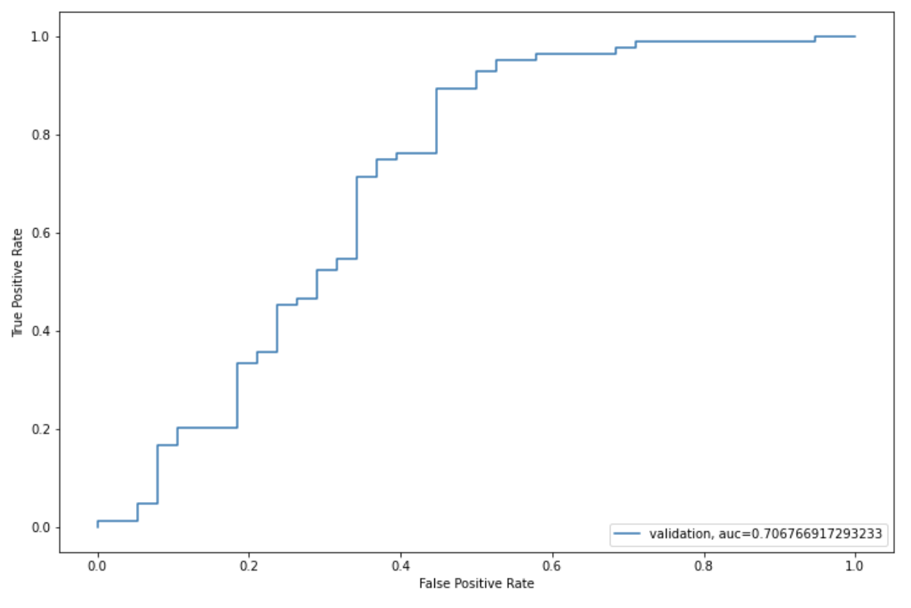
We got an auc value of 0.70
```
submission['Loan_Status']=pred_test
submission['Loan_ID']=test_original['Loan_ID']
```
Remember we need predictions in Y and N. So let's convert 1 and 0 to Y and N.
```
submission['Loan_Status'].replace(0, 'N', inplace=True)
submission['Loan_Status'].replace(1, 'Y', inplace=True)
pd.DataFrame(submission, columns=['Loan_ID','Loan_Status']).to_csv('Output/Log1.csv')
```
## Feature Engineering
Based on the domain knowledge, we can come up with new features that might affect the target variable. We will create the following three new features:
* **Total Income** - As discussed during bivariate analysis we will combine the Applicant Income and Co-applicant Income. If the total income is high, the chances of loan approval might also be high.
* **EMI** - EMI is the monthly amount to be paid by the applicant to repay the loan. The idea behind making this variable is that people who have high EMI's might find it difficult to pay back the loan. We can calculate the EMI by taking the ratio of the loan amount with respect to the loan amount term.
* **Balance Income** - This is the income left after the EMI has been paid. The idea behind creating this variable is that if this value is high, the chances are high that a person will repay the loan and hence increasing the chances of loan approval.
```
train['Total_Income']=train['ApplicantIncome']+train['CoapplicantIncome']
test['Total_Income']=test['ApplicantIncome']+test['CoapplicantIncome']
```
Let's check the distribution of Total Income.
```
sns.distplot(train['Total_Income'])
```
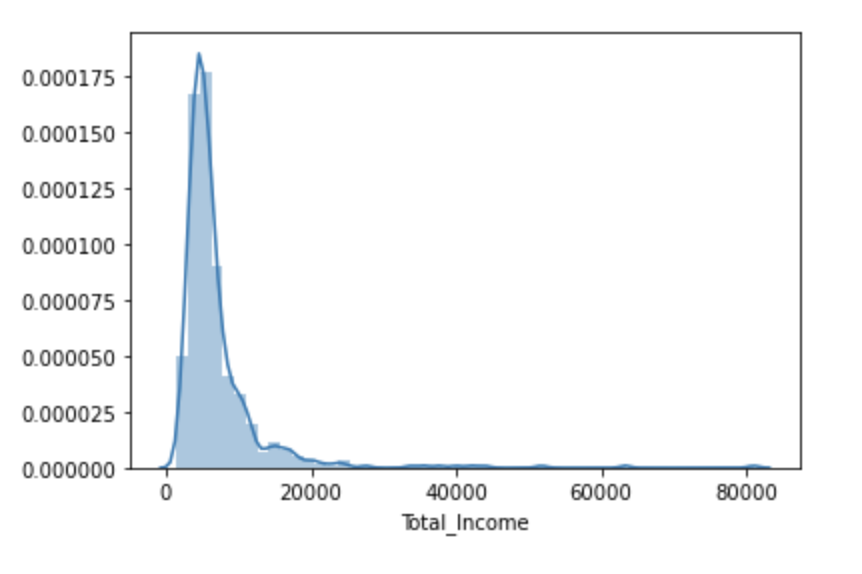
It can be seen, it is shifted towards the left, meaning the distribution is right-skewed. So, let's take the log transformation to make the distribution normal.
```
train['Total_Income_log'] = np.log(train['Total_Income'])
sns.distplot(train['Total_Income_log'])
test['Total_Income_log'] = np.log(test['Total_Income'])
```
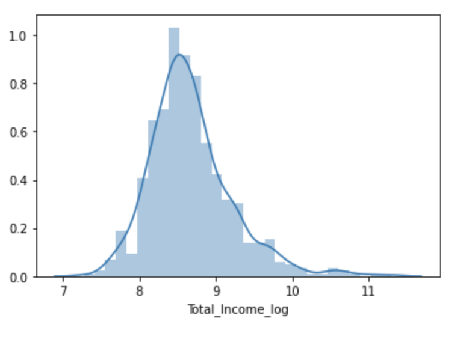
Now the distribution looks much closer to normal and the effect of extreme values has been significantly subsided. Let's create the EMI feature now.
```
train['EMI']=train['LoanAmount']/train['Loan_Amount_Term']
test['EMI']=test['LoanAmount']/test['Loan_Amount_Term']
```
Let's check the distribution of EMI variable.
```
sns.distplot(train['EMI'])
```
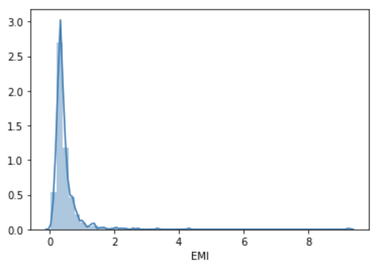
```
train['Balance Income'] = train['Total_Income']-(train['EMI']*1000)
test['Balance Income'] = test['Total_Income']-(test['EMI']*1000)
sns.distplot(train['Balance Income'])
```
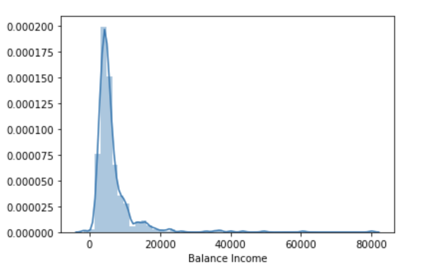
Let us now drop the variables which we used to create these new features. Reason for doing this is, the correlation between those old features and these new features will be very high and logistic regression assumes that the variables are not highly correlated. 

We also wants to remove the noise from the dataset, so removing correlated features will help in reducing the noise too.
```
train=train.drop(['ApplicantIncome', 'CoapplicantIncome', 'LoanAmount', 'Loan_Amount_Term'], axis=1)
test=test.drop(['ApplicantIncome', 'CoapplicantIncome', 'LoanAmount', 'Loan_Amount_Term'], axis=1)
```
## Model Building:Part 2
After creating new features, we can continue the model building process. So we will start with logistic regression model and then move over to more complex models like RandomForest and XGBoost. 

We will build the following models in this section.
* Logistic Regression
* Decision Tree
* Random Forest
* XGBoost

Let's prepare the data for feeding into the models.
```
X = train.drop('Loan_Status',1)
y = train.Loan_Status
```
### Logistic Regression
```
i=1
mean = 0
kf = StratifiedKFold(n_splits=5,random_state=1,shuffle=True)
for train_index,test_index in kf.split(X,y):
 print ('\n{} of kfold {} '.format(i,kf.n_splits))
 xtr,xvl = X.loc[train_index],X.loc[test_index]
 ytr,yvl = y[train_index],y[test_index]
 model = LogisticRegression(random_state=1)
 model.fit(xtr,ytr)
 pred_test=model.predict(xvl)
 score=accuracy_score(yvl,pred_test)
 mean += score
 print ('accuracy_score',score)
 i+=1
 pred_test = model.predict(test)
 pred = model.predict_proba(xvl)[:,1]
print ('\n Mean Validation Accuracy',mean/(i-1))
```
```
1 of kfold 5 
accuracy_score 0.7967479674796748

2 of kfold 5 
accuracy_score 0.6910569105691057

3 of kfold 5 
accuracy_score 0.6666666666666666

4 of kfold 5 
accuracy_score 0.7804878048780488

5 of kfold 5 
accuracy_score 0.680327868852459

 Mean Validation Accuracy 0.7230574436891909
```
```
submission['Loan_Status']=pred_test
submission['Loan_ID']=test_original['Loan_ID']
```
```
submission['Loan_Status'].replace(0, 'N', inplace=True)
submission['Loan_Status'].replace(1, 'Y', inplace=True)
```
```
pd.DataFrame(submission, columns=['Loan_ID','Loan_Status']).to_csv('Output/Log2.csv')
```
### Decision Tree
Decision tree is a type of supervised learning algorithm(having a pre-defined target variable) that is mostly used in classification problems. 

In this technique, we split the population or sample into two or more homogeneous sets(or sub-populations) based on most significant splitter / differentiator in input variables.

Decision trees use multiple algorithms to decide to split a node in two or more sub-nodes. The creation of sub-nodes increases the homogeneity of resultant sub-nodes. In other words, we can say that purity of the node increases with respect to the target variable.

For detailed explanation [check out this article.](https://www.analyticsvidhya.com/blog/2016/04/complete-tutorial-tree-based-modeling-scratch-in-python/#six)

Let's fit the decision tree model with 5 folds of cross-validation.
```
from sklearn import tree
i=1
mean = 0
kf = StratifiedKFold(n_splits=5,random_state=1,shuffle=True)
for train_index,test_index in kf.split(X,y):
    print ('\n{} of kfold {} '.format(i,kf.n_splits))
    xtr,xvl = X.loc[train_index],X.loc[test_index]
    ytr,yvl = y[train_index],y[test_index]
    model = tree.DecisionTreeClassifier(random_state=1)
    model.fit(xtr,ytr)
    pred_test=model.predict(xvl)
    score=accuracy_score(yvl,pred_test)
    mean += score
    print ('accuracy_score',score)
    i+=1
    pred_test = model.predict(test)
    pred = model.predict_proba(xvl)[:,1]
print ('\n Mean Validation Accuracy',mean/(i-1))
```
```
1 of kfold 5 
accuracy_score 0.7398373983739838

2 of kfold 5 
accuracy_score 0.6991869918699187

3 of kfold 5 
accuracy_score 0.7560975609756098

4 of kfold 5 
accuracy_score 0.7073170731707317

5 of kfold 5 
accuracy_score 0.6721311475409836

 Mean Validation Accuracy 0.7149140343862455
```
```
submission['Loan_Status']=pred_test
submission['Loan_ID']=test_original['Loan_ID']
```
```
submission['Loan_Status'].replace(0, 'N', inplace=True)
submission['Loan_Status'].replace(1, 'Y', inplace=True)
```
```
pd.DataFrame(submission, columns=['Loan_ID','Loan_Status']).to_csv('Output/DecisionTree.csv')
```

### Random Forest
RandomForest is a tree-based bootstrapping algorithm wherein a certain no. of weak learners (decision trees) are combined to make a powerful prediction model.

For every individual learner, a random sample of rows and a few randomly chosen variables are used to build a decision tree model.

Final prediction can be a function of all the predictions made by the individual learners.
In case of regression problem, the final prediction can be mean of all the predictions.

For detailed explanation you can [check out this article.](https://www.analyticsvidhya.com/blog/2016/04/complete-tutorial-tree-based-modeling-scratch-in-python/)
```
from sklearn.ensemble import RandomForestClassifier
i=1
mean = 0
kf = StratifiedKFold(n_splits=5,random_state=1,shuffle=True)
for train_index,test_index in kf.split(X,y):
 print ('\n{} of kfold {} '.format(i,kf.n_splits))
 xtr,xvl = X.loc[train_index],X.loc[test_index]
 ytr,yvl = y[train_index],y[test_index]
 model = RandomForestClassifier(random_state=1, max_depth=10)
 model.fit(xtr,ytr)
 pred_test=model.predict(xvl)
 score=accuracy_score(yvl,pred_test)
 mean += score
 print ('accuracy_score',score)
 i+=1
 pred_test = model.predict(test)
 pred = model.predict_proba(xvl)[:,1]
print ('\n Mean Validation Accuracy',mean/(i-1))
```
```
1 of kfold 5 
accuracy_score 0.8292682926829268

2 of kfold 5 
accuracy_score 0.8130081300813008

3 of kfold 5 
accuracy_score 0.7723577235772358

4 of kfold 5 
accuracy_score 0.8048780487804879

5 of kfold 5 
accuracy_score 0.7540983606557377

 Mean Validation Accuracy 0.7947221111555378
```
We will try to improve the accuracy by tuning the hyperparameters for this model. 

We will use grid search to get the optimized values of hyper parameters. Grid-search is a way to select the best of a family of hyper parameters, parametrized by a grid of parameters.

We will tune the max_depth and n_estimators parameters. max_depth decides the maximum depth of the tree and n_estimators decides the number of trees that will be used in random forest model.

### Grid Search
```
from sklearn.model_selection import GridSearchCV
paramgrid = {'max_depth': list(range(1,20,2)), 'n_estimators': list(range(1,200,20))}
grid_search=GridSearchCV(RandomForestClassifier(random_state=1),paramgrid)
```
```
from sklearn.model_selection import train_test_split
x_train, x_cv, y_train, y_cv = train_test_split(X,y, test_size=0.3, random_state=1)
grid_search.fit(x_train,y_train)
```
```
GridSearchCV(estimator=RandomForestClassifier(random_state=1),
             param_grid={'max_depth': [1, 3, 5, 7, 9, 11, 13, 15, 17, 19],
                         'n_estimators': [1, 21, 41, 61, 81, 101, 121, 141, 161,
                                          181]})
```            
```
grid_search.best_estimator_
```
```
RandomForestClassifier(max_depth=5, n_estimators=41, random_state=1)
```
```
i=1
mean = 0
kf = StratifiedKFold(n_splits=5,random_state=1,shuffle=True)
for train_index,test_index in kf.split(X,y):
    print ('\n{} of kfold {} '.format(i,kf.n_splits))
    xtr,xvl = X.loc[train_index],X.loc[test_index]
    ytr,yvl = y[train_index],y[test_index]
    model = RandomForestClassifier(random_state=1, max_depth=3, n_estimators=41)
    model.fit(xtr,ytr)
    pred_test = model.predict(xvl)
    score = accuracy_score(yvl,pred_test)
    mean += score
    print ('accuracy_score',score)
    i+=1
    pred_test = model.predict(test)
    pred = model.predict_proba(xvl)[:,1]
print ('\n Mean Validation Accuracy',mean/(i-1))
```
```
1 of kfold 5 
accuracy_score 0.8130081300813008

2 of kfold 5 
accuracy_score 0.8455284552845529

3 of kfold 5 
accuracy_score 0.8048780487804879

4 of kfold 5 
accuracy_score 0.7967479674796748

5 of kfold 5 
accuracy_score 0.7786885245901639

 Mean Validation Accuracy 0.8077702252432362
```
```
submission['Loan_Status']=pred_test
submission['Loan_ID']=test_original['Loan_ID']
```
```
submission['Loan_Status'].replace(0, 'N', inplace=True)
submission['Loan_Status'].replace(1, 'Y', inplace=True)
```
```
pd.DataFrame(submission, columns=['Loan_ID','Loan_Status']).to_csv('Output/RandomForest.csv')
```
Let us find the feature importance now, i.e. which features are most important for this problem. We will use feature_importances_ attribute of sklearn to do so.
```
importances=pd.Series(model.feature_importances_, index=X.columns)
importances.plot(kind='barh', figsize=(12,8))
```
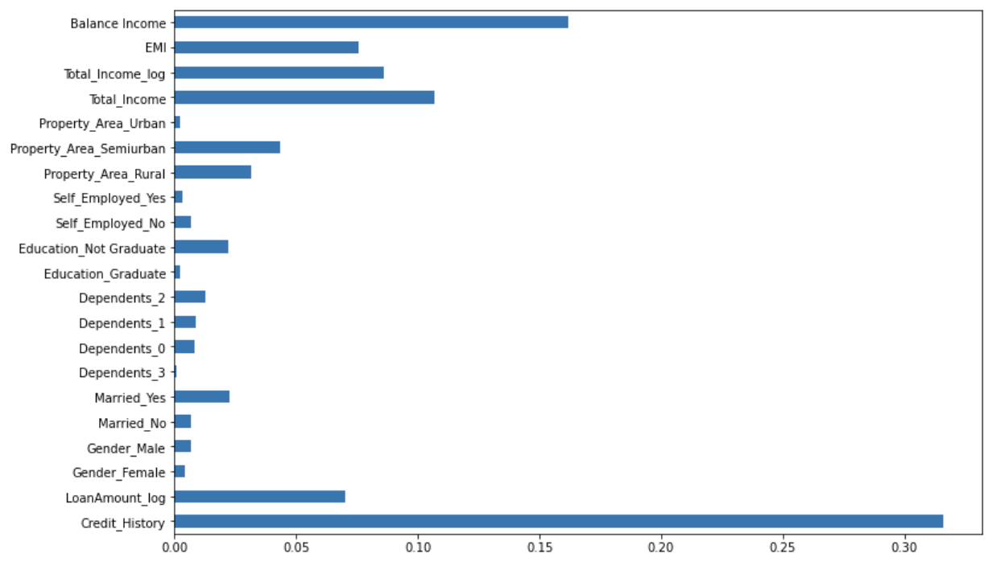
We can see that ```Credit_History``` is the most important feature followed by ```Balance Income```, ```Total Income```and ```EMI```. So, feature engineering helped us in predicting our target variable.

### XGBOOST
XGBoost is a fast and efficient algorithm and has been used by the winners of many data science competitions. You can [learn more about it in this article.](https://www.analyticsvidhya.com/blog/2015/11/quick-introduction-boosting-algorithms-machine-learning/)

XGBoost works only with numeric variables and we have already replaced the categorical variables with numeric variables. Let's have a look at the parameters that we are going to use in our model.

* n_estimator: This specifies the number of trees for the model.
* max_depth: We can specify the maximum depth of a tree using this parameter.

GBoostError: XGBoost Library (libxgboost.dylib) could not be loaded. If you face this error in macOS, run ```brew install libomp``` in ```Terminal```

```
from xgboost import XGBClassifier
i=1 
mean = 0
kf = StratifiedKFold(n_splits=5,random_state=1,shuffle=True) 
for train_index,test_index in kf.split(X,y): 
 print('\n{} of kfold {}'.format(i,kf.n_splits)) 
 xtr,xvl = X.loc[train_index],X.loc[test_index] 
 ytr,yvl = y[train_index],y[test_index] 
 model = XGBClassifier(n_estimators=50, max_depth=4) 
 model.fit(xtr, ytr) 
 pred_test = model.predict(xvl) 
 score = accuracy_score(yvl,pred_test) 
 mean += score
 print ('accuracy_score',score)
 i+=1
 pred_test = model.predict(test)
 pred = model.predict_proba(xvl)[:,1]
print ('\n Mean Validation Accuracy',mean/(i-1))
```
```
1 of kfold 5
accuracy_score 0.7804878048780488

2 of kfold 5
accuracy_score 0.7886178861788617

3 of kfold 5
accuracy_score 0.7642276422764228

4 of kfold 5
accuracy_score 0.7804878048780488

5 of kfold 5
accuracy_score 0.7622950819672131

 Mean Validation Accuracy 0.7752232440357191
```
```
submission['Loan_Status']=pred_test
submission['Loan_ID']=test_original['Loan_ID']
```
```
submission['Loan_Status'].replace(0, 'N', inplace=True)
submission['Loan_Status'].replace(1, 'Y', inplace=True)
```
```
pd.DataFrame(submission, columns=['Loan_ID','Loan_Status']).to_csv('Output/XGBoost.csv')
```
## SPSS Modeler
To create an SPSS Modeler Flow and build a machine learning model using it, follow the instructions here: [Predict loan eligibility using IBM Watson Studio](https://developer.ibm.com/tutorials/predict-loan-eligibility-using-jupyter-notebook-ibm-spss-modeler/)

Sign-up for an **IBM Cloud** account to try this tutorial — [IBM Cloud](https://ibm.biz/BdqQBT)

## Blogs 
[Predict Loan Eligibility using Machine Learning Models - towards data science](https://towardsdatascience.com/predict-loan-eligibility-using-machine-learning-models-7a14ef904057)

[Predict Loan Eligibility using Machine Learning Models - freeCodeCamp](https://www.freecodecamp.org/news/use-machine-learning-models-to-predict-loan-eligibility/)

## Conclusion
In this tutorial, we learned how to create models to predict the target variable, that is whether the applicant will be able to repay the loan or not.

This is a classification problem where we have to predict whether a loan will be approved or not. In a classification problem, we have to predict discrete values based on a given set of independent variable(s).

Loan prediction is a very common real-life problem that each retail bank faces at least once in its lifetime. If done correctly, it can save many hours of work.

Although this tutorial is specially built to give a walkthrough of a Loan Prediction problem, you can always refer the content to get a comprehensive overview to solve a classification problem.
